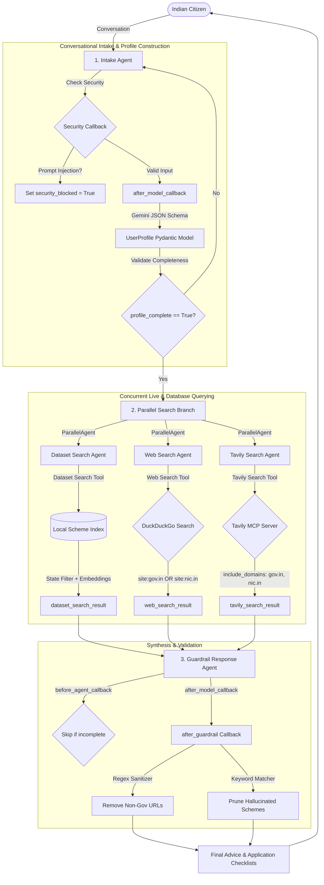

# BenefitBuddy 🤝
### *Democratizing Welfare Access via Multi-Agent AI & Live Government Guardrails*

**BenefitBuddy** is an intelligent welfare navigator that transforms how Indian citizens discover government schemes. Rather than filling out complex forms or parsing dense legal guidelines, users engage in a warm, natural conversation. The underlying multi-agent pipeline extracts their demographic profile, executes concurrent local and web searches, verifies eligibility, and enforces strict security and accuracy guardrails before recommending official resources.

This project was built as a capstone project for **Kaggle's 5-Day AI Agents: Intensive Vibe Coding Course with Google**, showcasing the orchestration capabilities of the **Google Agent Development Kit (ADK)** and the **Gemini API**.

---

## 📖 The Project Story & Vision

In India, accessing welfare is a multi-dimensional challenge:
- **The Information Gap**: Thousands of schemes exist across central and state departments, but they are documented in fragmented portals with dense legalese.
- **The Search Barrier**: Traditional keyword search is ineffective for users who don't know the exact names of schemes (e.g., searching for "help with farming" instead of "PM-KISAN").
- **Eligibility Matching**: Every scheme has distinct qualifiers (income caps, land ownership, occupation, state-level residence). A wrong recommendation leads to application rejection or wasted time.
- **Trust & Misinformation**: Online portals are rife with blog posts offering outdated or inaccurate scheme advice, sometimes leading to phishing sites.

**BenefitBuddy** addresses this by serving as a trustworthy, Conversational, and State-Aware Welfare Companion:
1. **Conversational Intake**: A single-topic, multi-turn dialogue gathers the user's Indian state, occupation, income, and family details.
2. **Context-Restricted Search (RAG)**: Search queries are pre-filtered based on the user's state, performing semantic retrieval on a local schemes database.
3. **Live Verification (DuckDuckGo)**: A concurrent web search fetches up-to-date details or application portals directly from official sites.
4. **AI-Optimized Search (Tavily MCP)**: Connects to Tavily's remote search MCP server over HTTP/SSE to obtain neural, high-precision results restricted to government portals.
5. **Strict URL & Hallucination Guardrails**: Outbound links are strictly limited to official government domains (`.gov.in`, `.nic.in`), and LLM recommendations are dynamically verified against retrieved sources to eliminate hallucinations.

---

## 🏗️ Multi-Agent Architecture

BenefitBuddy is implemented using the **Google Agent Development Kit (ADK)**, coordinating a sequential pipeline and parallel branches.



### Session State Variables
During execution, agents read and write to the shared session state:
*   `user_profile`: A JSON dictionary mapping extracted demographic keys (`state`, `occupation`, `annual_income`, `family_details`).
*   `profile_complete`: Boolean flag indicating conversational intake is done.
*   `security_blocked`: Boolean flag indicating prompt injection detected.
*   `dataset_search_result`: Text dump of retrieved local RAG schemes.
*   `web_search_result`: Text dump of retrieved live web schemes.
*   `tavily_search_result`: Text dump of retrieved live schemes using the remote Tavily MCP server.


---

## 🤖 Detailed Agent Breakdown

### 1. Intake Agent ([intake_agent/agent.py](file:///Volumes/HardDisk/git_projects/benefit_buddy/intake_agent/agent.py))
- **Role**: Converses warmly, asking one question at a time to gather demographic details.
- **Dynamic Pydantic Extraction**: An `after_model_callback` feeds the turn history to `gemini-2.5-flash` with a JSON schema constraint targeting the `UserProfile` Pydantic model. 
- **Normalization**: Automatically normalizes user inputs (e.g., converting "3 lakhs" or "300000" to `300000.0`).
- **Prompt Injection Defense**: A `before_agent_callback` checks inputs against signature injection patterns (e.g., "ignore all previous instructions"). If flagged, it sets `security_blocked = True` and terminates execution immediately.

### 2. Parallel Search Agent ([agent.py](file:///Volumes/HardDisk/git_projects/benefit_buddy/agent.py))
- **Role**: Coordinates three sub-agents concurrently using `ParallelAgent`.
- **Dataset Search Agent ([dataset_search_agent/agent.py](file:///Volumes/HardDisk/git_projects/benefit_buddy/dataset_search_agent/agent.py))**: Runs semantic retrieval against the local scheme index.
- **Web Search Agent ([web_search_agent/agent.py](file:///Volumes/HardDisk/git_projects/benefit_buddy/web_search_agent/agent.py))**: Runs DuckDuckGo query search to pull live updates.
- **Tavily Search Agent ([tavily_search_agent/agent.py](file:///Volumes/HardDisk/git_projects/benefit_buddy/tavily_search_agent/agent.py))**: Queries the remote Tavily MCP server to gather fresh search snippets.
- **Performance Benefit**: Using `ParallelAgent` reduces the latency of executing multiple slow search tools from sequential to parallel (max(T1, T2, T3)).

### 3. Guardrail Response Agent ([guardrail_response_agent/agent.py](file:///Volumes/HardDisk/git_projects/benefit_buddy/guardrail_response_agent/agent.py))
- **Role**: Synthesizes the demographic profile, database search results, and both web search updates to output eligibility guidelines.
- **Link Verification**: The `after_guardrail` callback parses any URLs generated by the LLM. Outbound links that do not resolve to `.gov.in` or `.nic.in` domains are automatically stripped and replaced with a standard blocker message.
- **Hallucination Pruning**: Every recommended scheme section must match keywords present in the search results (`dataset_search_result`, `web_search_result`, or `tavily_search_result`). If the LLM generates a recommendation not validated by the tools, the section is pruned, and a warning is printed.

---

## 🛠️ Tools Implementation

### Local RAG Database Tool ([tools/dataset_search_tool.py](file:///Volumes/HardDisk/git_projects/benefit_buddy/tools/dataset_search_tool.py))
1. **State-Level Partitioning**: Reads the user state from `tool_context.state`. It partitions the database, keeping only central schemes and state-specific schemes matching the user's residence (e.g., only Punjab and Central schemes for a user from Punjab). This significantly reduces search spaces and prevents invalid recommendations.
2. **Semantic Similarity**: Calls `gemini-embedding-2` to embed the search query and computes cosine similarities over the partitioned dataset, returning the top matches.

### Web Search Tool ([tools/web_search_tool.py](file:///Volumes/HardDisk/git_projects/benefit_buddy/tools/web_search_tool.py))
- Wraps DuckDuckGo's API and appends `(site:gov.in OR site:nic.in)` to the query automatically. This guarantees that even at the tool layer, no non-government domains are searched or retrieved.

### Tavily MCP Search Tool ([tools/tavily_search_tool.py](file:///Volumes/HardDisk/git_projects/benefit_buddy/tools/tavily_search_tool.py))
- Connects to Tavily's remote MCP server via HTTP/SSE (`streamable_http_client`), enforcing domain constraints via `include_domains=["gov.in", "nic.in"]` and returning parsed, consistently formatted search results.

### Security Tool ([tools/security_tool.py](file:///Volumes/HardDisk/git_projects/benefit_buddy/tools/security_tool.py))
- Scans input against a signature database of adversarial prompts, jailbreak patterns, instructions to reveal system prompts, or override requests.

---

## 💾 Dataset Details & Index Ingestion

The local database uses the public **[Indian Government Schemes Dataset](https://www.kaggle.com/datasets/nitishabharathi/indian-government-schemes)** by *nitishabharathi* on Kaggle. It contains structured details of over 500 central and state-level welfare programs.

- **Download**: Handled via `setup_data.py` using `kagglehub`.
- **Ingestion & Embedding ([index_data.py](file:///Volumes/HardDisk/git_projects/benefit_buddy/index_data.py))**:
  - Parses each scheme `.txt` file to extract state/scope, title, content, and official links.
  - Builds search passages.
  - Generates embeddings using `gemini-embedding-2` in batches of 100 documents to optimize request latency and token usage.
  - Saves the precompiled dataset with embeddings into `data/scheme_index.json`.

---

## 🚀 Installation & Local Execution

### 1. Prerequisites
Ensure you have Python 3.10+ installed and the required API credentials.
```bash
# Export your Gemini API Key
export GEMINI_API_KEY="your-gemini-api-key"

# (Optional) Export Kaggle credentials if needed for kagglehub downloads
export KAGGLE_USERNAME="your-kaggle-username"
export KAGGLE_KEY="your-kaggle-api-key"
```

### 2. Setup Environment
```bash
# Install dependencies
pip install -r requirements.txt
```

### 3. Ingest and Index Scheme Data
Run the setup script to download the schemes dataset from Kaggle, followed by the indexing script to generate vector embeddings:
```bash
# Download Kaggle dataset
python setup_data.py

# Create search index (requires GEMINI_API_KEY)
python index_data.py
```

### 4. Running the Agent (Developer UI)
You can run BenefitBuddy locally in the ADK interactive developer UI to test conversation flows:
```bash
adk dev-ui
```
Open the provided browser URL (e.g. `http://localhost:8000/dev-ui`) to chat with the agent and inspect state variables in real-time.

---

## 🧪 Testing & Red-Teaming

A complete automated suite verifies system robustness, security layers, and output sanitizers.

Run individual test files to check pipeline components:

```bash
# 1. Test conversational intake and Pydantic profile extraction
python -m tests.test_intake_agent

# 2. Test local state-restricted vector search
python -m tests.test_dataset_search

# 3. Test web search scope boundaries (.gov.in/.nic.in filters)
python -m tests.test_web_search

# 3b. Test Tavily search via remote MCP server (checks HTTP/SSE session and domain scoping)
python -m tests.test_tavily_search

# 4. Test security red-teaming (detect and block prompt injections)
python -m tests.test_security_red_team

# 5. Test end-to-end integration and URL/Hallucination guardrails
python -m tests.test_guardrail_agent
```

---

## 🌐 Google Cloud Deployment

BenefitBuddy uses ADK's native container builder to deploy directly to **Google Cloud Run**, serving a public chatbot UI.

The full deployment instructions, IAM bindings, and environment variable configuration are detailed in the [GCP Deployment Plan](file:///Volumes/HardDisk/git_projects/benefit_buddy/DEPLOYMENT.md).

To deploy the service in one command:
```bash
adk deploy cloud_run \
  --project=[YOUR_PROJECT_ID] \
  --region=[YOUR_REGION] \
  --deploy_web_ui \
  --env-vars GEMINI_API_KEY=[YOUR_GEMINI_API_KEY] \
  .
```

---

## 🛠️ Agent Skills & Workspace Customizations

BenefitBuddy leverages both development-time agent customizations (workspace skills) and runtime agent capabilities (Tavily MCP skills):

### Development-Time Customization Skills (`.agents/skills/`)
These project-scoped skills guide the AI coding assistant during design, development, and version control:
*   **`license-header-adder`**: Automatically prepends standard copyright and Apache 2.0 license headers to all new source files.
*   **`clean-mac-files`**: Spawns pre-push Git hooks to clean macOS metadata and AppleDouble files (`._*`) before pushing changes to GitHub.
*   **`git-commit-formatter`**: Enforces Conventional Commits formatting rules (e.g., `feat:`, `fix:`, `docs:`) for all repository commits.
*   **`database-schema-validator`**: Validates SQL schema compliance against strict naming, structural, and safety standards (no drop statements, snake_case tables).
*   **`json-to-pydantic`**: Helps convert JSON payloads and API responses into strongly-typed Pydantic classes for type-safe data integration.

### Runtime Agent Skills (Tavily MCP)
These capabilities are exposed as tools to the running agents in production:
*   **`tavily-search`**: Executes neural, context-sensitive web searches. Limited at the tool boundary to retrieve results exclusively from `.gov.in` and `.nic.in` domains.
*   **`tavily-extract`**: Dynamically downloads and extracts clean, structured markdown from government web pages. This enables the agent to parse actual guidelines and eligibility rules from official portals to avoid snippets-based hallucination.

---

## 🏆 Key Achievements (Kaggle Capstone Alignment)

- **Problem Definition**: Directly addresses the massive structural barrier for low-income Indian citizens accessing complex welfare programs.
- **Orchestration**: Combines multi-turn structured extraction (Intake), multi-agent parallel branches (Web + DB Search), and custom callbacks (Guardrail).
- **Safety First**: Implements prompt-injection checks at the intake gate, forces domain limitations at the web search tool, and performs post-processing link verification and hallucination detection to ensure no false advice is shared.
- **RAG Optimization**: Partitions search spaces dynamically using state scoping, avoiding index pollution and reducing vector query latencies.
